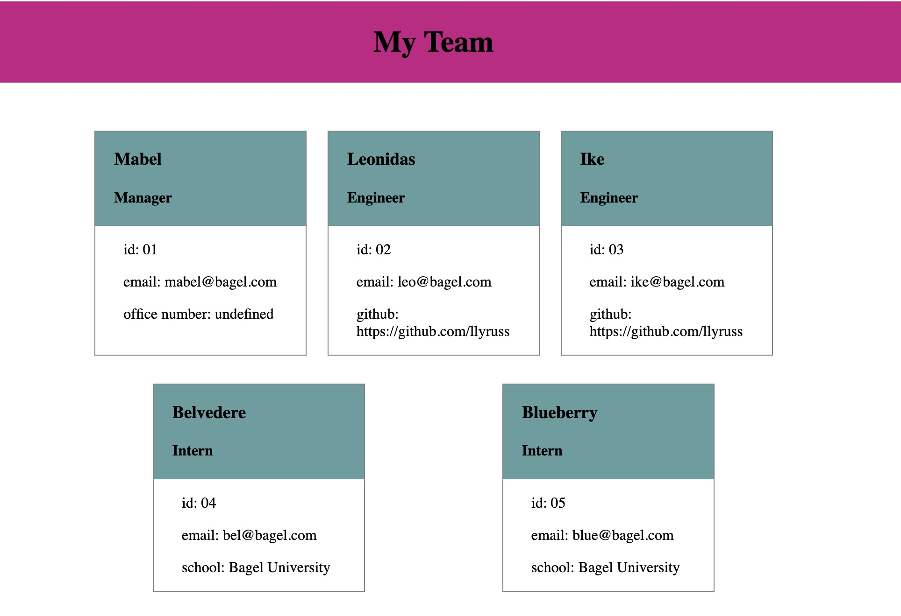

# Team-Profile-Generator

## Description

This product allows a user to generate a webpage displaying their employee team by answering CLI questions.

## Installation

This project requires the use of node.js and npm. 

## Usage

Open integrated terminal
Run npm i
Run npm run test to make sure the classes and methods work
Run node index.js and answer the prompted question to create your html document.

A video walk though of useage can be seen here: https://drive.google.com/file/d/122PGFrkKmWRe6y1blcbZlNS1jIA6RAKd/view

Example of a generated team:

    
   
## License

MIT License